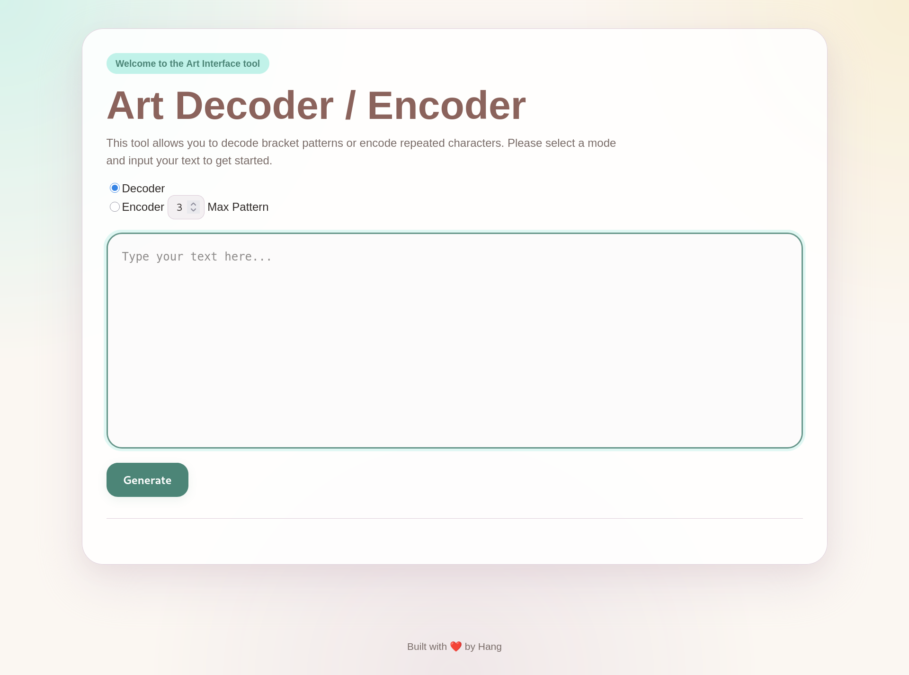

# Art Interface

> **Art Interface** is a Go web application that encodes and decodes text using a custom bracket-based pattern format.

---

## Screenshot



## Features

* Decode bracket patterns into repeated text
* Encode repeated characters or patterns
* Supports multi-line input
* Adjustable **Max Pattern** value
* Clean web interface built with HTML and CSS
* Helpful error handling for invalid input

---

## Encoding Format

The decoder uses this pattern:

```text
[count pattern]
```

Example:

```text
[5 A]
```

Output:

```text
AAAAA
```

Pattern example:

```text
[3 ab]
```

Output:

```text
ababab
```

---

## How to Run

### 1. Clone the repository

```bash
git clone https://gitea.kood.tech/kimhangngo/interface
cd interface
```

### 2. Run the server

```bash
go run .
```

### 3. Open in browser

```text
http://localhost:8080
```

---

## Web Routes

| Method | Route          | Description                            |
| ------ | -------------- | -------------------------------------- |
| `GET`  | `/`            | Shows the main web interface           |
| `POST` | `/transformer` | Encodes or decodes the submitted input |
| `GET`  | `/static/`     | Serves CSS files                       |

---

## How to Use

1. Choose **Decoder** or **Encoder**
2. Enter your text in the input box
3. Adjust **Max Pattern** if needed (default: 3)
4. Click **Generate**
5. View the result below the form

---

## Decode Example

Input:

```text
Hello [5 !]
```

Output:

```text
Hello !!!!!
```

---

## Encode Example

Input:

```text
aaaaabbbbcc
```

Output:

```text
[5 a][4 b]cc
```

> Note: single-character patterns are only encoded when they repeat at least 3 times.

---

## Multi-line Example

Input:

```text
AAAAA
BBBB
Hello [3 !]
```

Output in encode mode:

```text
[5 A]
[4 B]
Hello [3 !]
```

---

## Max Pattern

The **Max Pattern** value controls the largest pattern size the encoder can detect.

Example with repeated pattern:

```text
abababab
```

With max pattern `2`, the encoder can detect:

```text
[4 ab]
```

---

## Error Handling

The decoder app can return errors for cases such as:

| Error Case                     | Example        |
| ------------------------------ | -------------- |
| Empty input                    | empty textarea |
| Unbalanced brackets            | `[5 A`         |
| Missing space                  | `[5A]`         |
| Missing first argument         | `[ A]`         |
| Missing second argument        | `[5 ]`         |
| First argument is not a number | `[A hello]`    |

---

## Project Structure

```text
.
├── main.go
├── handler.go
├── html
│   └── index.html
├── static
│   └── style.css
└── utils
    ├── balance.go
    ├── decode.go
    ├── encode.go
    └── multiline.go
```

## 🎨 Interface Design

| Color | Preview | Usage |
|---|---|---|
| Smoky Rose |  | Headings and labels |
| Royal Gold |  | Output section |
| Jungle Teal |  | Buttons and accents |
| Pearl Aqua |  | Highlight elements |
| Thistle |  | Borders and shadows |